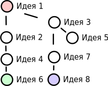

# Plant Simulator — История Идей — Кислород

## Идея 1 ±
Автор: **[raptor-mvk](https://github.com/raptor-mvk)**\
Дата: **17.07.2023**

Надо кислород добавить. Например, чтобы животные потребляли его, а растения производили.

## Идея 2 ±
Автор: **Supermouse**\
Дата: **17.07.2023**\
Родитель: **Идея 1**

Надо сделать так, чтобы растения могли производить кислород, а животные потреблять его. И чтобы если он кончался, то все погибали.

## Идея 3 ±
Автор: **[Megospc](https://github.com/Megospc)**\
Дата: **08.08.2023**\
Родитель: **Идея 1**

Можно сделать атмосферу, в ней будут разные газы. Например: азот, кислород и углекислый газ. Растения могут углекислый газ в кислород превращать, а животные  — наоборот. А ещё можно сделать ядовитые газы вроде метана. Если их становится много, то все начинают вымирать.

## Идея 4 +
Автор: **[Megospc](https://github.com/Megospc)**\
Дата: **08.08.2023**\
Родитель: **Идея 2**

Настройки:
- Изначальный кислород

Свойства:
- растения: Кислородность
- животные: Кислородность
- грибы: Кислородность

Если значение **настройки «Изначальный кислород»** больше **0**, то **запас кислорода** устанавливается на указанное значение. Все растения каждый кадр увеличивают его на значение **свойства «Кислородность»**. Все животные и грибницы уменьшают его на значение **свойства «Кислородность»**. При этом если он опускается ниже нуля, то животное или грибница, которые уменьшали его, умирают. А **запас кислорода** принимает значение **0**.

Количество кислорода отображается справа от суммарной популяции в просмотре и в разделе **«Служебная информация»** расширенной статистики. Также график его количества отображается в разделе **«Другие объекты»** расширенной статистики.

## Идея 5 ±
Автор: **Supermouse**\
Дата: **08.08.2023**\
Родитель: **Идея 3**

Надо сделать так, чтобы можно было создавать разные газы. Т. е. создать новый раздел **«Виды газов»** в редакторе.

## Идея 6 ++
**Реализованно в качестве предварительной версии (1.5.2A)**

Автор: **[Megospc](https://github.com/Megospc)**\
Дата: **08.08.2023**\
Родитель: **Идея 4**

**Идея 4**, но грибницы потребляют кислород в количестве **[значение свойства «Кислородность»]×([размер грибницы в клетках]^1.5)**, а текущее количество кислорода отображается только в разделе «Служебная информация» расширенной статистики.

## Идея 7 +++
Автор: **[Megospc](https://github.com/Megospc)** при содействии **Supermouse**\
Дата: **08.08.2023** - **09.08.2023**\
Родитель: **Идея 3**

Настройки:
- Атмосфера — кислород
- Атмосфера — углекислый газ
- Атмосфера — метан

Свойства:
- растения: Кислород
- животные: Кислород
- грибы: Кислород
- растения: Метан
- животные: Метан
- грибы: Метан
- растения: Углекислый газ
- животные: Углекислый газ
- грибы: Углекислый газ

Существуют счётчики кислорода, метана и углекислого газа. Изначально они равны значениям соответствующих **настроек «Атмосфера — кислород», «Атмосфера — метан» и «Атмосфера — углекислый газ»**. Все растения и животные каждый кадр изменяют эти счётчики на значения соответствующих **свойств «Кислород», «Метан» и «Углекислый газ»**. Грибницы изменяют их в том же количестве, но умноженном на **[Количество клеток земли, которое занимает грибница]^1.5**. Если вдруг значение одного из счётчиков становится ниже **0**, то растение, животное или грибница погибает, а счётчик принимает значение **0**.

Текущее количество газов отображается в разделе **«Состояние атмосферы»** расширенной статистики. Также график их количества отображается в разделе **«Другие объекты»** расширенной статистики.

## Идея 8 💎
**Реализованно в качестве полной версии (1.5.5)**

Автор: **[Megospc](https://github.com/Megospc)** при содействии **Supermouse**\
Дата: **09.08.2023**\
Родитель: **Идея 7**

Настройки:
- Атмосфера — кислород
- Атмосфера — углекислый газ
- Атмосфера — метан

Свойства:
- растения: Кислород
- животные: Кислород
- грибы: Кислород
- растения: Нужный кислород
- животные: Нужный кислород
- грибы: Нужный кислород
- растения: Метан
- животные: Метан
- грибы: Метан
- растения: Нужный метан
- животные: Нужный метан
- грибы: Нужный метан
- растения: Углекислый газ
- животные: Углекислый газ
- грибы: Углекислый газ
- растения: Нужный углекислый газ
- животные: Нужный углекислый газ
- грибы: Нужный углекислый газ

Существуют счётчики кислорода, метана и углекислого газа. Изначально они равны значениям соответствующих **настроек «Атмосфера — кислород», «Атмосфера — метан» и «Атмосфера — углекислый газ»**. Все растения и животные каждый кадр изменяют эти счётчики на значения соответствующих **свойств «Кислород», «Метан» и «Углекислый газ»**. Грибницы изменяют их в том же количестве, но умноженном на **[Количество клеток земли, которое занимает грибница]^1.5**. Если после этого значение одного из счётчиков становится ниже **0**, то растение, животное или грибница погибает, а счётчик принимает значение **0**. Также растение, животное или грибница умирает, если один из счётчиков меньше значения соответствующих **свойств «Нужный кислород», «Нужный метан» и «Нужный углекислый газ»**.

Текушее количество газов отображается в разделе **«Состояние атмосферы»** расширенной статистики. Также график их количества отображается в разделе **«Другие объекты»** расширенной статистики.

## Карта идей
